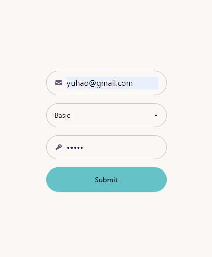
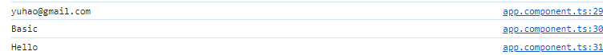

# Angular Assignments

This is a project and assignment completion repository of my attempt for the Udemy course:
#### [Angular - The Complete Guide (2024 Edition)](https://www.udemy.com/course/the-complete-guide-to-angular-2/)

## Assignment
### Form

### Form Logs

## Run the application

Run `ng serve` to show the local application at `http://localhost:4200/`.

